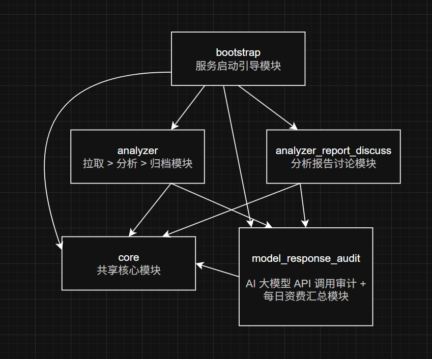

# Linux 内核邮件补丁分析、归档、讨论服务

<div>
    
    <a href="https://skillicons.dev">
        
    </a>
</div>

从邮箱服务中拉取 Linux 内核补丁邮件，交给 AI 去分析后归档，
回归传统的多模块单体阻塞式架构 (Tomcat + V-Thread)。

## 系统架构图

```txt
┌──────────────────────────────────────────────────────────────────────────────────────────────────────┐
│                                      External Middleware Service                                     │
│                                                                                                      │
│   ┌────────────────┐  ┌────────────────┐  ┌────────────────┐  ┌────────────────┐  ┌────────────────┐ │
│   │   Gmail IMAP   │  │  DeepSeek API  │  │    RabbitMQ    │  │     Redis      │  │     MySQL      │ │
│   │  (LKML 邮箱)   │  │ (分析 + 讨论)  │   │   (消息队列)   │  │   (RESP 协议)  │   │  (数据持久化)  │ │
│   └───────┬────────┘  └───────▲────────┘  └───────▲────────┘  └───────▲────────┘  └───────▲────────┘ │
└───────────┼───────────────────┼───────────────────┼───────────────────┼───────────────────┼──────────┘
            │ IMAP              │ HTTPS / SSE       │ AMQP              │ RESP              │ JDBC
            │                   │                   │                   │                   │
┌───────────▼───────────────────▼───────────────────▼───────────────────▼───────────────────▼──────────┐
│                    Linux Kernel Email List Analyzer (单体服务)                                        │
│                                                                                                      │
│   Tomcat + Virtual Threads                                                                           │
│   执行器：email-service-executor / analyze-report-discuss-executor                                   │
│                                                                                                      │
│  ┌────────────────────────────────────────────────────────────────────────────────────────────────┐  │
│  │  bootstrap                                                                                     │  │
│  │                                                                                                │  │
│  │  LinuxKernalEmailListAnalyzerApplication  (启动入口)                                           │  │
│  └────────────────────────────────────────────────────────────────────────────────────────────────┘  │
│                                                                                                      │
│  ┌────────────────────────────────────────────────────────────────────────────────────────────────┐  │
│  │  core 模块（公共基础设施）                                                                     │  │
│  │                                                                                                │  │
│  │  • SingleImapConnectionImpl + ImapConnectionKeepAlive  (IMAP 连接管理 / 保活)                  │  │
│  │  • KernelEmailStatus 枚举  (0 ~ 12 状态机状态)                                                 │  │
│  │  • TimeMonitorAspect  (AOP 耗时统计)                                                           │  │
│  │  • GlobalIdConsumer  (全局 ID 生成)                                                            │  │
│  │  • 实体 / DTO / Properties / Repository / Utils / Exception                                    │  │
│  └────────────────────────────────────────────────────────────────────────────────────────────────┘  │
│                                                                                                      │
│  ┌────────────────────────────────────────────────────────────────────────────────────────────────┐  │
│  │  analyzer 模块（核心流水线）                                                                   │  │
│  │                                                                                                │  │
│  │  [定时调度] KernelEmailPusherImpl                                                              │  │
│  │       │                                                                                        │  │
│  │       │  1. IMAP 拉取未读邮件（批量 50，阅后即焚）                                              │  │
│  │       │  2. 解析为 PlainTextEmail                                                              │  │
│  │       │  3. 插入 linux_kernal_email 表（状态 = FETCHED）                                       │  │
│  │       │  4. 推送 RabbitMQ（状态 → PUSHED / PUSH_FAILED）                                       │  │
│  │       ▼                                                                                        │  │
│  │  RabbitMQ Queue (lkml)                                                                         │  │
│  │       │                                                                                        │  │
│  │       └──► KernelEmailAnalyzerServiceImpl  (@RabbitListener)                                   │  │
│  │                │                                                                               │  │
│  │                │  状态机驱动 (KernelEmailStateMachineImpl + Spring StateMachine)               │  │
│  │                │                                                                               │  │
│  │                │  FETCHED → ANALYSIS_PENDING → ANALYZING → ANALYSIS_SUCCESS/FAILED             │  │
│  │                │           → GENERATING → GENERATE_SUCCESS/FAILED                              │  │
│  │                │           → REPORT_PERSISTING → REPORT_PERSISTENCE_SUCCESS/FAILED             │  │
│  │                │                                                                               │  │
│  │                ├─ KernelEmailDeepSeekAnalyzer          (调用 DeepSeek 分析)                    │  │
│  │                ├─ AIModelAnswerAuditService            (审计响应)                              │  │
│  │                ├─ LKMLAnalyzeTemplateGeneratorImpl     (Thymeleaf 生成 HTML 报告)              │  │
│  │                └─ LKMLAnalyzeReportWriterImpl          (本地文件持久化)                        │  │
│  │                                                                                                │  │
│  │  KernelEmailClassifierImpl  (邮件分类辅助)                                                     │  │
│  └────────────────────────────────────────────────────────────────────────────────────────────────┘  │
│                                                                                                      │
│  ┌────────────────────────────────────────────────────────────────────────────────────────────────┐  │
│  │  analyze_report_discuss 模块（交互讨论）                                                       │  │
│  │                                                                                                │  │
│  │  Controller → AnalyzeReportDiscussServiceImpl                                                  │  │
│  │       │                                                                                        │  │
│  │       │  1. DiscussSessionLockGuard                (会话串行锁，防并发)                        │  │
│  │       │  2. 插入 ai_analyze_discuss_session_details                                            │  │
│  │       │  3. KenelEmailAnalyzeReportRedisCacher     (从 Redis / DB 加载报告)                    │  │
│  │       │  4. ModelPromptReader + DiscussAbstractCacher                                          │  │
│  │       │         (系统 / 用户提示词 + 历史摘要)                                                 │  │
│  │       │  5. OkHttp SSE 调用 DeepSeek（流式）                                                   │  │
│  │       │  6. SSECallBack + ResponseChunkHandler                                                 │  │
│  │       │         (异步推送前端 + 审计 + 摘要)                                                   │  │
│  │       │                                                                                        │  │
│  │  AnalyzeReportDiscussDeepSeekAbstractor  (上下文摘要)                                          │  │
│  │  Session / Details Service               (会话管理)                                            │  │
│  └────────────────────────────────────────────────────────────────────────────────────────────────┘  │
│                                                                                                      │
│  ┌────────────────────────────────────────────────────────────────────────────────────────────────┐  │
│  │  model_response_audit 模块（审计与计费）                                                       │  │
│  │                                                                                                │  │
│  │  AIModelAnswerAuditServiceImpl                                                                 │  │
│  │       ├─ ai_model_answer_audit     (任务元数据)                                                │  │
│  │       ├─ ai_model_answer_content   (推理 + 输出内容)                                           │  │
│  │       └─ ai_model_answer_usage     (Token 明细)                                                │  │
│  │                                                                                                │  │
│  │  AIModelDailyBillingServiceImpl  (每日汇总，幂等结算)                                          │  │
│  │       └─ ai_model_daily_billing    (按模型 + 日期聚合费用)                                     │  │
│  │                                                                                                │  │
│  │  Token 计算组件 + 转换器                                                                       │  │
│  └────────────────────────────────────────────────────────────────────────────────────────────────┘  │
└──────────────────────────────────────────────────────────────────────────────────────────────────────┘
```

## 模块设计

```txt
linux_kernel_email_list_analyzer (父 POM)
├── bootstrap          # 启动入口 + 资源配置
├── core               # 公共核心（IMAP、状态枚举、AOP、实体、工具、配置属性）
├── analyzer           # 邮件拉取 → 推送 MQ → 消费分析 → 报告生成 → 持久化
├── analyze_report_discuss  # 分析报告讨论 / 答疑（SSE + Redis 缓存 + 会话）
└── model_response_audit    # AI 模型响应审计 + 每日 Token 费用汇总
```

### 依赖关系图

<div>
    
</div>

### 快速跳转

- [bootstrap 项目引导模块](https://github.com/JesseZ332623/Linux-Kernel-Email-List-Analyzer/tree/develop/bootstrap/src/main)

- [core 服务核心模块](https://github.com/JesseZ332623/Linux-Kernel-Email-List-Analyzer/tree/develop/core/src/main/java/com/jesse/core)

- [analyzer 内核补丁邮件拉取 -> 分析 -> 归档模块](https://github.com/JesseZ332623/Linux-Kernel-Email-List-Analyzer/tree/develop/analyzer/src/main/java/com/jesse/analyzer)

- [analyze_report_discuss 内核邮件分析报告讨论模块](https://github.com/JesseZ332623/Linux-Kernel-Email-List-Analyzer/tree/develop/analyze_report_discuss/src/main/java/com/jesse/analyze_report_discuss)

- [model_response_audit 模型调用审计模块](https://github.com/JesseZ332623/Linux-Kernel-Email-List-Analyzer/tree/develop/model_response_audit/src/main/java/com/jesse/response_audit)

## 代码速览

### core 模块

- [单邮件服务 IMAP 连接实例管理器](https://github.com/JesseZ332623/Linux-Kernel-Email-List-Analyzer/blob/develop/core/src/main/java/com/jesse/core/components/imap_connection/impl/SingleImapConnectionImpl.java)

- [IMAP 连接实例 keep-alive 定期保活组件](https://github.com/JesseZ332623/Linux-Kernel-Email-List-Analyzer/blob/develop/core/src/main/java/com/jesse/core/components/imap_connection/impl/ImapConnectionKeepAlive.java)

- [TimeMonitor 计时器切面实现](https://github.com/JesseZ332623/Linux-Kernel-Email-List-Analyzer/blob/develop/core/src/main/java/com/jesse/core/components/aspect/TimeMonitorAspect.java)

- [表示一封内核补丁邮件在本服务所有状态的枚举](https://github.com/JesseZ332623/Linux-Kernel-Email-List-Analyzer/blob/develop/core/src/main/java/com/jesse/core/enums/KernelEmailStatus.java)

### model_response_audit 模块

- [AI 模型 LKML 分析任务响应审计表服务类实现](https://github.com/JesseZ332623/Linux-Kernel-Email-List-Analyzer/blob/develop/model_response_audit/src/main/java/com/jesse/response_audit/service/impl/AIModelAnswerAuditServiceImpl.java)

- [AI 模型 token 资费消耗每日汇总表服务类实现](https://github.com/JesseZ332623/Linux-Kernel-Email-List-Analyzer/blob/develop/model_response_audit/src/main/java/com/jesse/response_audit/service/impl/AIModelDailyBillingServiceImpl.java)

### analyzer 模块

- [内核邮件分类器](https://github.com/JesseZ332623/Linux-Kernel-Email-List-Analyzer/blob/develop/analyzer/src/main/java/com/jesse/analyzer/components/classifier/impl/KernelEmailClassifierImpl.java)

- [Linux 内核补丁邮件推送器](https://github.com/JesseZ332623/Linux-Kernel-Email-List-Analyzer/blob/develop/analyzer/src/main/java/com/jesse/analyzer/components/kernel_email_pusher/impl/KernelEmailPusherImpl.java)

- [内核邮件 -> DeepSeek 模型分析器](https://github.com/JesseZ332623/Linux-Kernel-Email-List-Analyzer/blob/develop/analyzer/src/main/java/com/jesse/analyzer/components/kernel_email_analyzer/impl/KernelEmailDeepSeekAnalyzer.java)

- [LKML 内核补丁邮件分析报告生成器](https://github.com/JesseZ332623/Linux-Kernel-Email-List-Analyzer/blob/develop/analyzer/src/main/java/com/jesse/analyzer/components/analyze_report_generator/impl/LKMLAnalyzeTemplateGeneratorImpl.java)

- [LKML 内核补丁邮件分析结果持久化器](https://github.com/JesseZ332623/Linux-Kernel-Email-List-Analyzer/blob/develop/analyzer/src/main/java/com/jesse/analyzer/components/report_persistence/impl/LKMLAnalyzeReportWriterImpl.java)

- [Linux 内核补丁邮件分析服务](https://github.com/JesseZ332623/Linux-Kernel-Email-List-Analyzer/blob/develop/analyzer/src/main/java/com/jesse/analyzer/service/impl/KernelEmailAnalyzerServiceImpl.java)

- [内核邮件分析状态机实现](https://github.com/JesseZ332623/Linux-Kernel-Email-List-Analyzer/blob/develop/analyzer/src/main/java/com/jesse/analyzer/components/state_machine/impl/KernelEmailStateMachineImpl.java) 

### model_response_audit 模块

- [AI 模型 SSE 协议响应流处理回调实现](https://github.com/JesseZ332623/Linux-Kernel-Email-List-Analyzer/blob/develop/core/src/main/java/com/jesse/core/enums/KernelEmailStatus.java)

- [SSE 响应数据片处理器](https://github.com/JesseZ332623/Linux-Kernel-Email-List-Analyzer/blob/develop/analyze_report_discuss/src/main/java/com/jesse/analyze_report_discuss/components/sse_callback/ResponseChunkHandler.java)

- [分析报告讨论上下文 DeepSeek 摘要器实现](https://github.com/JesseZ332623/Linux-Kernel-Email-List-Analyzer/blob/develop/analyze_report_discuss/src/main/java/com/jesse/analyze_report_discuss/components/discuss_abstract/impl/AnalyzeReportDiscussDeepSeekAbstractor.java)

- [内核邮件分析报告 Redis 缓存器实现](https://github.com/JesseZ332623/Linux-Kernel-Email-List-Analyzer/blob/develop/analyze_report_discuss/src/main/java/com/jesse/analyze_report_discuss/components/report_cache/impl/KenelEmailAnalyzeReportRedisCacher.java)

- [Linux 内核邮件分析报告疑惑解答会话表服务实现类](https://github.com/JesseZ332623/Linux-Kernel-Email-List-Analyzer/blob/develop/analyze_report_discuss/src/main/java/com/jesse/analyze_report_discuss/service/impl/AnalyzeReportDiscussSessionServiceImpl.java)

- [Linux 内核邮件分析报告疑惑解答会话对话内容表服务实现类](https://github.com/JesseZ332623/Linux-Kernel-Email-List-Analyzer/blob/develop/analyze_report_discuss/src/main/java/com/jesse/analyze_report_discuss/service/impl/AnalyzeReportDiscussSessionDetailsServiceImpl.java)

- [内核邮件分析报告讨论服务实现](https://github.com/JesseZ332623/Linux-Kernel-Email-List-Analyzer/blob/develop/analyze_report_discuss/src/main/java/com/jesse/analyze_report_discuss/service/impl/AnalyzeReportDiscussServiceImpl.java)

## LICENCE

[Apache License Version 2.0](https://github.com/JesseZ332623/Linux-Kernal-Email-List-Analyzer/blob/main/LICENSE)

## 2026.08.11
